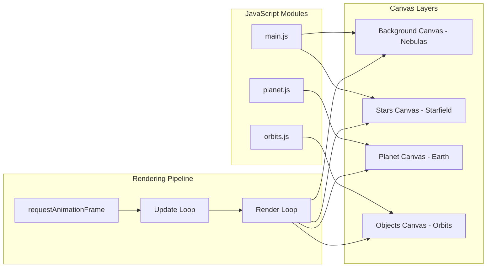

# Website Specification

## Project Overview
This document outlines the specification for an immersive, space-themed website featuring a rotating Earth-like planet with orbiting objects. The project uses JavaScript and HTML5 Canvas to create an interactive scene with a planet at the bottom of the viewport, complete with continents, oceans, and clouds. Two space objects (astronaut and satellite) orbit around the planet, while the JPD logo is positioned above. The design incorporates a dark, cosmic color scheme with red accents to align with the brand identity.

## Visual Design

### Color Scheme
- **Background**: Eigengrau (`#16161D`)
- **Primary Accent**: Pure red (`#FF0000`)
- **Secondary Colors**: Dark reds, deep purples, and blues for gradients and depth
- **Stars**: A mix of white, blue-white, yellow-white, and red-tinted stars
- **Planet Colors**: 
  - Oceans: Deep blues (`#1e3a5f`, `#2c5282`)
  - Continents: Greens and browns (`#2d5016`, `#8b7355`)
  - Clouds: White with transparency (`rgba(255, 255, 255, 0.4)`)
  - Atmosphere: Subtle blue glow (`rgba(135, 206, 235, 0.3)`)

### Branding
- **Logo File**: `assets/jpdlogo.png`
- **Favicon**: `assets/jpdico.png`

## Core Features

### Rotating Planet
A realistic Earth-like planet positioned at the bottom of the viewport.
- **Position**: Bottom center, with only the upper hemisphere visible
- **Size**: Responsive, approximately 40-60% of viewport width
- **Rotation**: Continuous slow rotation from west to east
- **Visual Elements**:
  - **Continents**: Procedurally generated or sprite-based landmasses
  - **Oceans**: Dynamic water texture with subtle shimmer effect
  - **Clouds**: Semi-transparent cloud layer that rotates independently
  - **Atmosphere**: Thin atmospheric glow around the planet's edge
  - **Day/Night Cycle**: Optional subtle shading to simulate lighting
- **Rendering**: Canvas-based rendering with layered approach for performance

### Orbiting Space Objects
Two space objects that orbit around the planet periodically.
- **Objects**: 
  - Astronaut (`assets/jpdaustronaut.png`)
  - Satellite (`assets/satellite.png`)
- **Orbital Mechanics**:
  - **Orbit Paths**: Elliptical orbits at different altitudes and angles
  - **Orbit Speed**: Variable speeds (satellite faster than astronaut)
  - **Orbit Timing**: Objects appear intermittently, not constantly visible
  - **Perspective**: Objects scale based on distance from viewer
  - **Rotation**: Objects rotate slowly as they orbit
- **Visual Effects**:
  - **Particle Trails**: Subtle particle effects following the objects
  - **Occlusion**: Objects pass behind the planet when on far side of orbit
  - **Glow Effect**: Soft glow when objects are in "sunlight"

### Logo Positioning
The JPD logo positioned prominently above the planet.
- **Position**: Fixed above the planet, centered horizontally
- **Distance**: Approximately 20-30% of viewport height above planet's top edge
- **Visual Effects**:
  - **Pulsing Glow**: Red drop-shadow glow animation
  - **Parallax**: Subtle movement in response to mouse/device orientation
  - **Z-Index**: Layered above planet but below orbiting objects when they pass in front

### Dynamic Starfield (Background)
The existing starfield system remains as the cosmic backdrop.
- **Star Population**: ~1000 stars, with density adjusted for screen size
- **Star Colors**: Mix of white/blue-white (70%), yellow-white (20%), and red-tinted (10%)
- **Special Stars**:
  - **Red Giants**: Larger stars with pulsing red glow
  - **Twinkling Stars**: Gentle twinkling animation
  - **Shining Stars**: Occasional bright cross-shaped glint effects
- **Shooting Stars**: Periodic streaks across the background
- **Parallax**: Multi-layer parallax effect for depth

### Nebula Clouds (Background)
Subtle nebula effects to add cosmic atmosphere.
- **Appearance**: Soft radial gradients in red and purple hues
- **Animation**: Slow drift across viewport
- **Layering**: Behind stars but above base background

---

## Technical Implementation

### File Structure
```
/
├── index.html
├── assets/
│   ├── jpdlogo.png
│   ├── jpdico.png
│   ├── jpdaustronaut.png
│   └── satellite.png
├── styles/
│   ├── main.css
│   └── animations.css
└── scripts/
    ├── main.js
    ├── planet.js      # New: Planet rendering and animation
    └── orbits.js      # New: Orbital mechanics for objects
```

### Key Technologies
- **Rendering**: HTML5 Canvas 2D API for planet, starfield, and effects
- **Planet Generation**:
  - Procedural texture generation for continents and oceans
  - Perlin noise for realistic terrain patterns
  - Multiple canvas layers for planet components (land, water, clouds)
- **Orbital Physics**:
  - Kepler's laws for realistic orbital motion
  - 3D to 2D projection for depth perception
  - Quaternion-based rotation for smooth object orientation
- **Animation**:
  - `requestAnimationFrame` for smooth 60 FPS rendering
  - Separate animation loops for different elements (planet, orbits, background)
- **Performance Optimizations**:
  - Off-screen canvas for planet texture caching
  - Dirty rectangle rendering for selective updates
  - Level-of-detail system for distant objects
- **Interactivity**:
  - Mouse parallax for logo and subtle planet tilt
  - Device orientation support for mobile devices
  - Click interactions to trigger orbital object appearances

### CSS Architecture
```css
:root {
  /* Brand Colors */
  --primary-red: #FF0000;
  --red-glow: 0 0 10px rgba(255, 255, 255, 0.3), 0 0 20px rgba(255, 255, 255, 0.2);
  --background-color: #16161D;
  
  /* Planet Colors */
  --ocean-deep: #1e3a5f;
  --ocean-shallow: #2c5282;
  --land-green: #2d5016;
  --land-brown: #8b7355;
  --cloud-white: rgba(255, 255, 255, 0.4);
  --atmosphere-blue: rgba(135, 206, 235, 0.3);
}
```

### JavaScript Module Structure
- **main.js**: Core initialization and coordination
- **planet.js**: Planet rendering engine
  - `PlanetRenderer` class for texture generation
  - `CloudLayer` class for animated clouds
  - `AtmosphereEffect` class for glow effects
- **orbits.js**: Orbital mechanics system
  - `OrbitCalculator` class for physics
  - `SpaceObject` class for astronaut/satellite
  - `ParticleTrail` class for visual effects

---

## Implementation Phases

### Phase 1: Planet Foundation
1. Create planet rendering system with basic sphere
2. Add texture generation for continents and oceans
3. Implement rotation animation
4. Position at bottom of viewport with proper scaling

### Phase 2: Visual Enhancement
1. Add cloud layer with independent rotation
2. Implement atmospheric glow effect
3. Add subtle lighting/shading for realism
4. Optimize rendering performance

### Phase 3: Orbital System
1. Implement orbital path calculations
2. Add astronaut and satellite objects
3. Create smooth orbital animations
4. Add particle trail effects

### Phase 4: Integration & Polish
1. Position logo above planet
2. Integrate with existing starfield system
3. Add interactivity (mouse/device orientation)
4. Performance optimization and testing

---

## Performance Considerations

### Rendering Strategy
- **Planet**: Render to off-screen canvas, update only on rotation
- **Orbits**: Calculate positions mathematically, render only visible objects
- **Background**: Keep existing low-frequency update for nebulas
- **Composite**: Layer canvases for optimal performance

### Mobile Optimization
- **Reduced Detail**: Lower resolution textures on mobile
- **Simplified Effects**: Fewer particles and simpler shaders
- **Touch Interactions**: Optional tap to trigger orbits
- **Battery Saving**: Reduce animation frequency on low battery

### Browser Compatibility
- **Canvas 2D**: Wide support across all modern browsers
- **Fallbacks**: Static planet image for older browsers
- **Progressive Enhancement**: Core features work everywhere
- **Feature Detection**: Check for device orientation API

---

## Accessibility Features

### Visual Accessibility
- **Reduced Motion**: Respect `prefers-reduced-motion` setting
  - Static planet without rotation
  - No orbiting objects
  - Minimal parallax effects
- **High Contrast**: Optional mode with clearer planet features
- **Color Blind Friendly**: Distinct shapes for continents

### Screen Reader Support
- **ARIA Labels**: Descriptive labels for interactive elements
- **Live Regions**: Announce when objects enter orbit
- **Keyboard Navigation**: Tab through interactive elements

---

## Future Enhancements (Optional)

### Advanced Planet Features
- **Weather Systems**: Animated storm systems on planet surface
- **City Lights**: Nightside illumination patterns
- **Seasonal Changes**: Varying ice caps and vegetation
- **Ring System**: Optional planetary rings

### Enhanced Orbital Mechanics
- **Multiple Orbits**: More objects with varied paths
- **Orbital Decay**: Objects gradually falling to planet
- **Gravitational Slingshot**: Objects using planet's gravity
- **Space Debris**: Small particles in various orbits

### Interactive Elements
- **Click to Launch**: Click planet to launch objects
- **Orbit Control**: Drag to adjust orbital parameters
- **Time Control**: Speed up/slow down animations
- **Easter Eggs**: Hidden interactions and animations

---

## Technical Architecture Diagram



---

## Known Limitations

- **Performance**: Complex planet rendering may impact FPS on low-end devices
- **Memory Usage**: Multiple canvas layers increase memory footprint
- **iOS Orientation**: Requires user permission for device orientation
- **WebGL Alternative**: Currently using Canvas 2D, WebGL could improve performance but reduces compatibility
